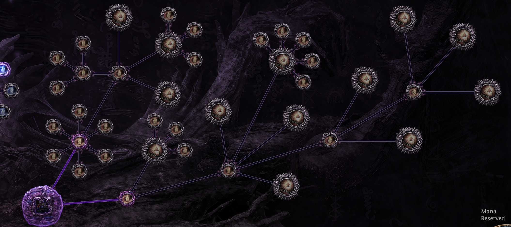

<div align="center">

# Genesis Tree Calculator

Planner for the Unique item branch of Path of Exile's Genesis Tree.

## [Open The Live Calculator](https://takola.github.io/poe_genesis_tree/)

<p>
  
</p>

</div>

> [!NOTE]
> This readme is AI generated but its a good summary of what i would write if i had bothered

## What The Page Is For

The site exists to answer a practical farming question:

**If you want one specific unique from the Genesis Tree, which passive setup gives you the best odds per Ancient Wombgift?**


## What The Site Does

- Searches the supported unique pool by exact name and shows quick metadata like tier, attribute requirements, and whether a foulborn variant exists.
- Optimizes the Unique tree for a chosen point budget.
- Lets you switch to **Manual** mode and click nodes yourself.
- Models **Non-Foulborn**, **Any**, and **Foulborn** targeting, including options for multiple foulborn modifiers and avoiding corrupted non-foulborn outcomes.

## How The Model Works

This calculator is built around the **Unique item womb** from The Genesis Tree.

At a high level, it combines three layers:

1. **Genesis Tree unique-womb mechanics**
   It models the passive effects that matter for unique outcomes, such as additional item chance, item-class weighting, attribute-requirement bias, foulborn conversion modifiers, and the rarest-of-two behavior from Recessive Genes.

2. **A generated unique-item dataset**
   The public data file [uniques.csv](uniques.csv) is the input pool used by the web app. It contains the unique name, item class, base item, approximate tier label, level requirement, attribute requirements, foulborn availability, and wiki link.

3. **Tier-based weighting assumptions**
   The calculator uses community-researched unique tier data as a practical stand-in for drop weighting. That lets the site compare tree choices in a consistent way even though the underlying game does not expose its exact formulas directly.

## Data Sources Behind The Model

This project summarizes information from public community documentation and turns it into a planning tool.

- [The Genesis Tree](https://www.poewiki.net/wiki/The_Genesis_Tree)
  Used for the structure and behavior of the mechanic itself, especially the Unique item womb, additional item nodes, category bias nodes, foulborn-related notables, and general Ancient Wombgift context.

- [Guide: Analysis of unique item tiers](https://www.poewiki.net/wiki/Guide:Analysis_of_unique_item_tiers)
  Used as the main source for the modeled unique pool and approximate tier information that powers [uniques.csv](uniques.csv).

> [!NOTE]
> The unique-tier guide is community research based on testing and reverse engineering. It is useful for planning, but it is not an official drop-rate specification and can drift when Path of Exile patches change the mechanic.

## Model Boundaries

This is a planning tool, not an exact in-game simulator.

- The site focuses on the **Unique item womb**. It does not try to simulate the full Currency, Equipment, or Mysterious womb trees.
- Unique tiers are modeled from community findings, not from official internal weighting tables.
- The in-game mechanic can change between patches without warning.
- `uniques.csv` now includes Breach uniques tagged with `drop_pool` and `is_breach_unique`, but the calculator still models only the current core pool until Breach-only rules are implemented.
- Results are best used for **relative comparisons** between tree setups, not as guarantees of exact live odds.

## Repo Layout

- [src/App.jsx](src/App.jsx): main calculator UI.
- [src/lib/genesis-engine.js](src/lib/genesis-engine.js): unique-pool parsing, tree topology, weighting rules, validation, and optimizer logic.
- [uniques.csv](uniques.csv): generated public dataset used by the web app.
- [generate_genesis_uniques.py](generate_genesis_uniques.py): refreshes [uniques.csv](uniques.csv) from PoE Wiki data.
- [generate_unique_price_csv.py](generate_unique_price_csv.py): optional price export helper for separate economy work.

## Running Locally

### Web App

```bash
npm install
npm run dev
```

Create a production build with:

```bash
npm run build
```

### Refreshing The Unique Dataset

If you want to rebuild [uniques.csv](uniques.csv), install the Python dependencies first:

```bash
pip install -r requirements.txt
python generate_genesis_uniques.py
```

## Why It Is A Static Page

The calculator is intentionally published as a static React/Vite app so it can live on GitHub Pages with no backend, no auth, and no server state. All of the planning logic runs in the browser against the generated CSV data checked into the repo.

That makes the page easy to share, easy to host, and easy to inspect.

## Attribution

This repo summarizes and links to community-maintained sources rather than reproducing their full pages or tables. If you want the underlying mechanic details or the latest tier-research context, start with the two source pages linked above.